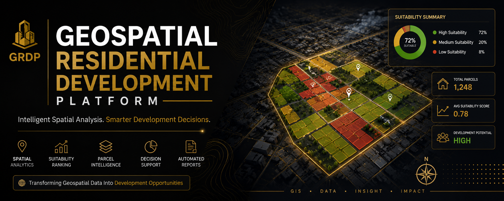
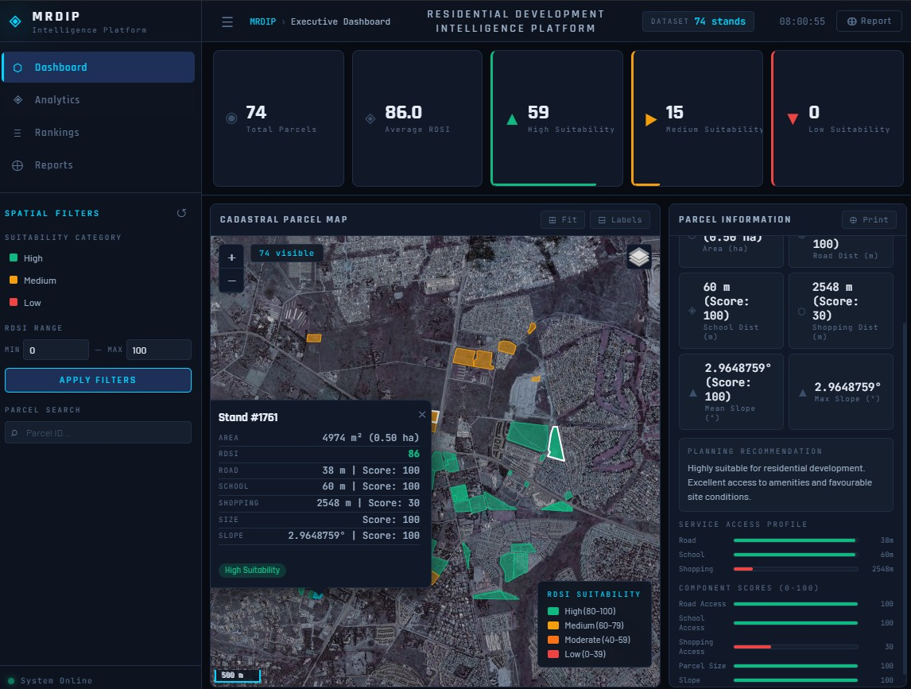

<div align="center">

# Geospatial Residential Development Platform



### Intelligent GIS Platform for Residential Suitability Analysis & Spatial Decision Support


---

*A modern geospatial decision-support platform that helps planners, developers, and decision-makers identify and rank residential development opportunities using GIS, spatial analytics, and interactive dashboards.*

</div>

---

#  Dashboard Preview

<p align="center">

</p>

---

# Features

-  Interactive analytics dashboard
-  Geospatial suitability analysis
-  Residential parcel ranking
-  High / Medium / Low suitability classification
-  Spatial filtering tools
-  Automated report generation
-  KPI summaries
-  GeoJSON support
-  Modern dark UI

---

#  Technology Stack

| Category | Technologies |
|-----------|--------------|
| Frontend | HTML5 • CSS3 • JavaScript |
| GIS | GeoJSON • Spatial Analysis |
| Visualization | Interactive Dashboard |
| Data | Residential Parcel Dataset |

---

# Project Structure

```text
geospatial-residential-development-platform/
│
├── assets/
│   ├── banner.png
│   └── dashboard.png
│
├── index.html
├── style.css
├── app.js
├── residential_suitability.geojson
└── README.md
```

---

#  Getting Started

Clone the repository

```bash
git clone https://github.com/Sam-uvas/geospatial-residential-development-platform.git
```

Open the project

```bash
cd geospatial-residential-development-platform
```

Run a local server

```bash
python -m http.server
```

Visit

```
http://localhost:8000
```

---

#  Platform Modules

- Dashboard
- Analytics
- Parcel Rankings
- Reports
- Spatial Filters
- KPI Monitoring

---

#  Use Cases

- Residential development planning
- Land suitability assessment
- Urban planning
- GIS decision support
- Spatial intelligence
- Infrastructure planning

---

#  Future Improvements

- PostgreSQL/PostGIS integration
- Python backend
- User authentication
- PDF report export
- Machine learning suitability models
- Real-time GIS data updates
- Cloud deployment

---

#  Author

## Sam Banele Mahlangu


---

<div align="center">


</div>
